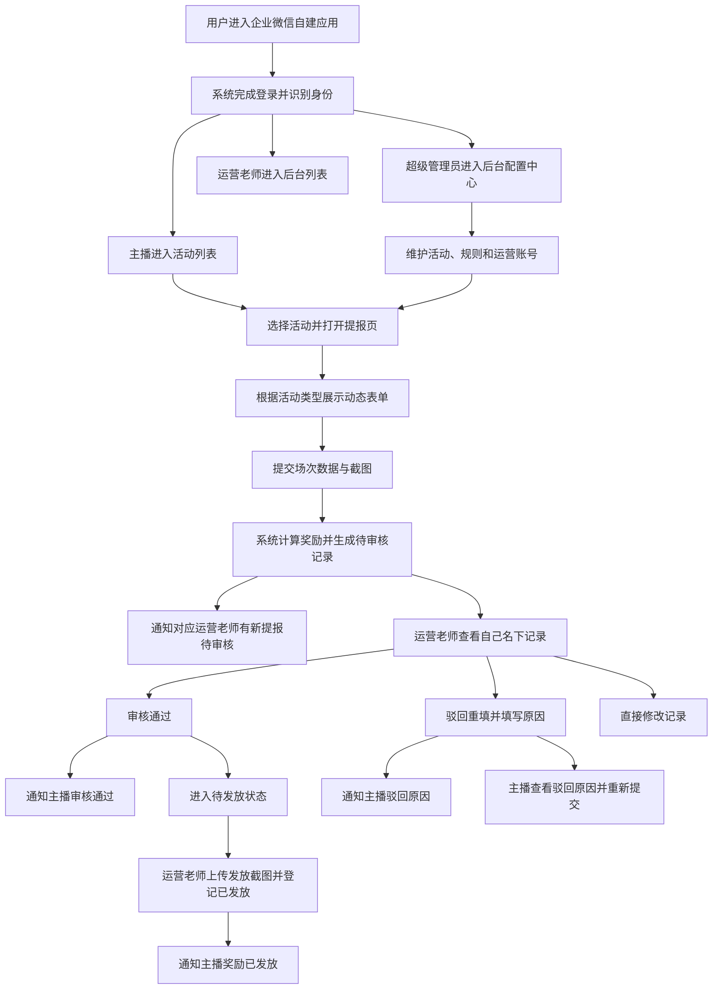

## 1. 产品概述
礼物收集活动管理系统用于支撑直播公会的多活动运营，覆盖主播提报、运营审核、奖励计算、发放留痕和后台配置全流程。
- 解决主播活动数据分散、人工统计易出错、奖励核算不统一、发放过程难追溯的问题。
- 支持长期复用和多活动并行，既能承载“礼物收集类”活动，也能承载“PK 值类”活动。

## 2. 核心功能

### 2.1 用户角色
| 角色 | 登录方式 | 核心权限 |
|------|----------|----------|
| 主播 | 企业微信自建应用登录 | 查看可参与活动、按场次提交数据、查看和修改自己的未审核记录、查看驳回原因和奖励结果 |
| 运营老师 | 企业微信自建应用登录 | 查看自己名下主播数据、审核通过、驳回重填、修改记录、登记奖励发放、上传发放截图、导出自己权限范围内数据 |
| 超级管理员 | 企业微信自建应用登录 | 查看和修改全部数据、管理活动、配置活动类型规则、配置礼物和奖励规则、管理运营老师账号、导出全量数据 |

### 2.2 功能模块
1. **企业微信登录与权限分流**：统一登录入口，按身份自动进入主播端或后台管理端。
2. **活动管理**：创建活动、设置活动时间、选择活动类型、配置参与规则和状态。
3. **主播提报**：按场次提交活动数据，支持多项目填写、多图上传、自动计算奖励结果。
4. **审核与修改**：运营老师审核通过、驳回并填写原因、直接修正数据；主播按规则修改未审核记录。
5. **奖励计算与发放**：按活动类型套用不同统计逻辑，输出命中奖励，并保留发放截图和发放记录。
6. **企业微信通知**：主播提交后通知对应运营老师；运营老师审核通过、驳回、发放后通知主播，并保留通知发送记录。
7. **后台查询与导出**：按活动、主播、运营老师、日期、审核状态、发放状态筛选，并导出表格。
8. **基础配置**：维护运营老师账号、活动类型、礼物项、奖励规则、发放状态规则。

### 2.3 活动类型定义
| 活动类型 | 收集内容 | 提报方式 | 统计维度 | 奖励计算方式 |
|----------|----------|----------|----------|--------------|
| 礼物收集类 | 礼物名称 + 数量 | 一场可填多个礼物项目 | 同一主播 + 同一活动 + 同一天累计 | 根据当日累计数量命中礼物奖励规则，可同时命中多个礼物奖励 |
| PK 值类 | 本场 PK 值 | 一场填写一个 PK 值结果 | 单场独立统计，不累计 | 根据本场 PK 值匹配对应奖励规则 |

### 2.4 页面明细
| 页面名称 | 模块名称 | 功能说明 |
|----------|----------|----------|
| 登录分流页 | 企业微信登录回调 | 完成企业微信授权、获取身份、分发到主播端或后台 |
| 主播活动页 | 活动列表 | 展示当前可参与活动、活动时间、活动类型、提报入口 |
| 主播提报页 | 基础信息 | 选择活动、填写主播姓名、选择运营老师、填写日期与开播时间 |
| 主播提报页 | 动态提报表单 | 根据活动类型展示不同字段；礼物类支持多礼物项目，PK 类填写本场 PK 值 |
| 主播提报页 | 截图上传 | 支持多张截图上传，提交前校验必填项 |
| 主播记录页 | 我的记录 | 查看自己的历史提报、审核状态、驳回原因、奖励结果、发放状态 |
| 主播记录详情页 | 编辑与重提 | 未审核且活动未结束时可修改；驳回后可按原因修正并重新提交 |
| 运营后台列表页 | 数据筛选 | 按主播、运营老师、活动、日期、审核状态、发放状态查询 |
| 运营后台详情页 | 审核操作 | 查看提报详情、截图大图、当天累计或单场结果、审核通过、驳回并填写原因 |
| 运营后台详情页 | 数据修改 | 修改主播姓名、礼物明细、PK 值、截图、备注等信息并保留操作记录 |
| 发放管理页 | 发放登记 | 将奖励状态从待发放改为已发放时必须上传发放截图，并记录发放时间与备注 |
| 通知记录页 | 消息记录 | 查看通知对象、通知类型、发送时间、发送结果、失败原因 |
| 超管活动管理页 | 活动配置 | 新建活动、设置开始结束时间、选择活动类型、控制是否启用 |
| 超管规则配置页 | 礼物/PK 规则 | 为不同活动类型配置提报项和奖励规则，支持后续复用 |
| 超管账号管理页 | 运营老师管理 | 新增、编辑、停用运营老师账号，并配置权限范围 |
| 导出页 | 导出报表 | 导出主播名字、运营老师、日期、礼物明细、当天累计、命中奖励、审核状态、发放状态、截图链接等字段 |

## 3. 核心流程
主播通过企业微信进入系统后，先看到当前可参与的活动列表。选择活动后，系统根据活动类型动态生成表单；礼物收集类按场次录入礼物项目和数量，PK 值类录入本场 PK 值。提交后系统立即根据活动规则计算奖励结果，并生成待审核记录，同时通过企业微信自建应用通知对应运营老师尽快审核。

运营老师登录后台后，只能看到自己名下主播选择了自己的提报记录。运营老师可以审核通过、驳回重填或直接修改数据；驳回时必须填写原因。审核通过后的记录进入待发放状态，并通过企业微信通知主播审核结果；驳回后也要把驳回原因通知主播。发放时必须上传发放截图后才能改为已发放，发放成功后同样需要通知主播。

超级管理员拥有全局管理权限，可维护多活动、多活动类型和多套规则，也可纠正任意记录、管理运营老师账号并导出全量报表。

## 4. 核心业务规则
### 4.1 提报规则
- 活动支持开始时间和结束时间控制，只有活动进行中才允许主播新增提报。
- 主播按场次提交，一次提交可以包含多个礼物项目；PK 值类活动一次提交只填本场 PK 值。
- 主播姓名允许在提交时手动修改，不强制使用企业微信昵称。
- 主播提交时必须选择运营老师，用于确定记录归属。
- 礼物类和 PK 类都要求上传截图凭证，支持多图上传。

### 4.2 修改规则
- 主播只能修改自己的记录。
- 当活动未结束且记录尚未审核时，主播可以直接修改。
- 被驳回的记录，主播可根据驳回原因修改后重新提交。
- 已审核通过的记录，主播不可再改，只能由运营老师或超级管理员修改。
- 运营老师只能修改自己名下记录；超级管理员可修改全部记录。

### 4.3 审核规则
- 审核状态至少包含：待审核、已通过、已驳回。
- 运营老师驳回时必须填写驳回原因。
- 审核操作和修改操作都需要保留时间、操作人和说明，便于追溯。

### 4.4 奖励计算规则
- 礼物收集类活动：按“同一主播 + 同一活动 + 同一天”聚合礼物数量，再匹配奖励规则。
- PK 值类活动：按单场记录单独计算，不做跨场累计。
- 同一条记录或同一天统计结果可以同时命中多个奖励规则。
- 系统提交后即展示自动计算结果，后台修改后需要重新计算最新奖励结果。

### 4.5 发放规则
- 发放状态先支持：待发放、已发放。
- 审核通过后，记录进入待发放状态。
- 运营老师把状态改为已发放时，必须上传发放截图。
- 发放记录需保留发放时间、发放人、发放备注和发放截图。

### 4.6 通知规则
- 主播提交成功后，系统必须通知本次选择的运营老师有新的待审核记录。
- 运营老师审核通过后，系统必须通知主播该记录已审核通过。
- 运营老师驳回后，系统必须通知主播该记录已被驳回，并带上驳回原因摘要。
- 运营老师登记已发放后，系统必须通知主播奖励已发放。
- 通知通道统一使用企业微信自建应用消息。
- 每次通知都需记录通知对象、通知类型、发送时间、发送结果和失败原因，便于排查。

## 5. 用户界面设计
### 5.1 设计风格
- 主色建议使用深蓝灰 + 高亮青色，强调专业、清晰、适合后台与直播数据场景。
- 按钮风格建议采用圆角中等、层次清晰的现代卡片式设计，重要动作使用高对比色。
- 字体建议采用中文无衬线字体，标题强调层级，正文保证易读。
- 布局采用桌面优先的双层结构：左侧菜单 + 右侧工作区；主播端可采用顶部卡片式流程布局。
- 图标风格保持简洁、统一，减少花哨装饰，突出状态与操作反馈。

### 5.2 页面设计概览
| 页面名称 | 模块名称 | UI 元素 |
|----------|----------|----------|
| 主播活动页 | 活动卡片 | 活动状态标签、时间区间、活动类型标签、立即填报按钮 |
| 主播提报页 | 动态表单 | 分组表单、礼物明细行、多图上传组件、自动计算结果预览 |
| 我的记录页 | 记录列表 | 审核状态标记、发放状态标记、驳回原因提示、快捷修改入口 |
| 运营后台列表页 | 筛选工具栏 | 搜索框、日期范围、活动筛选、状态筛选、导出按钮 |
| 运营后台详情页 | 数据卡片 | 主播信息、场次信息、截图预览、奖励结果、审核按钮 |
| 超管规则配置页 | 规则编辑器 | 活动类型切换、规则表格、奖励配置弹窗、启停开关 |
| 发放管理页 | 发放面板 | 待发放列表、截图上传区、发放备注、已发放时间展示 |

### 5.3 响应式策略
- 采用桌面优先设计，优先满足运营后台高频使用场景。
- 主播端页面需适配手机企业微信内打开，保证表单输入、图片上传和记录查看顺畅。
- 后台在平板和窄屏下保留核心功能，复杂表格可转为抽屉或分段展示。

## 6. 报表与导出
- 导出字段至少包含：主播名字、运营老师、日期、活动名称、活动类型、礼物明细或 PK 值、当天累计、命中奖励、审核状态、发放状态、截图链接。
- 建议附加字段：提交时间、审核时间、发放时间、驳回原因、发放备注。
- 导出范围需遵循权限控制，运营老师仅能导出自己名下数据，超级管理员可导出全部数据。

## 7. 非功能要求
- 所有关键操作需记录日志，包括提交、修改、审核、驳回、发放、规则配置变更。
- 上传图片需支持预览、压缩和安全校验，避免无效或超大文件影响体验。
- 奖励计算需保证修改后可即时重算，避免统计口径不一致。
- 权限判断必须以后端为准，前端只做展示控制，避免越权查看和导出。
- 通知发送失败时需保留失败原因，至少支持人工排查和后续重发能力。
