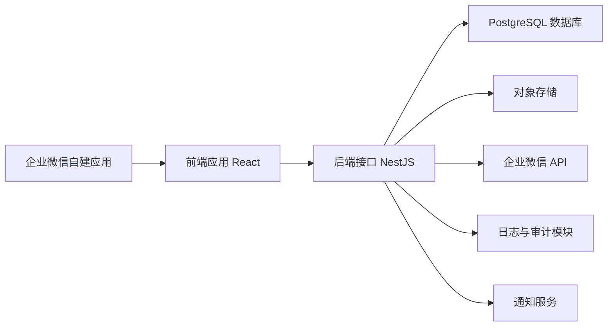
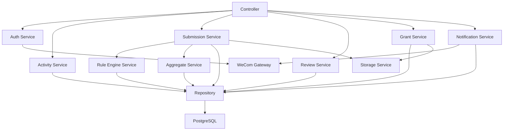
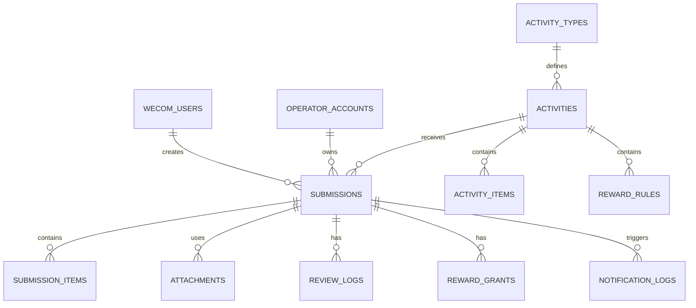
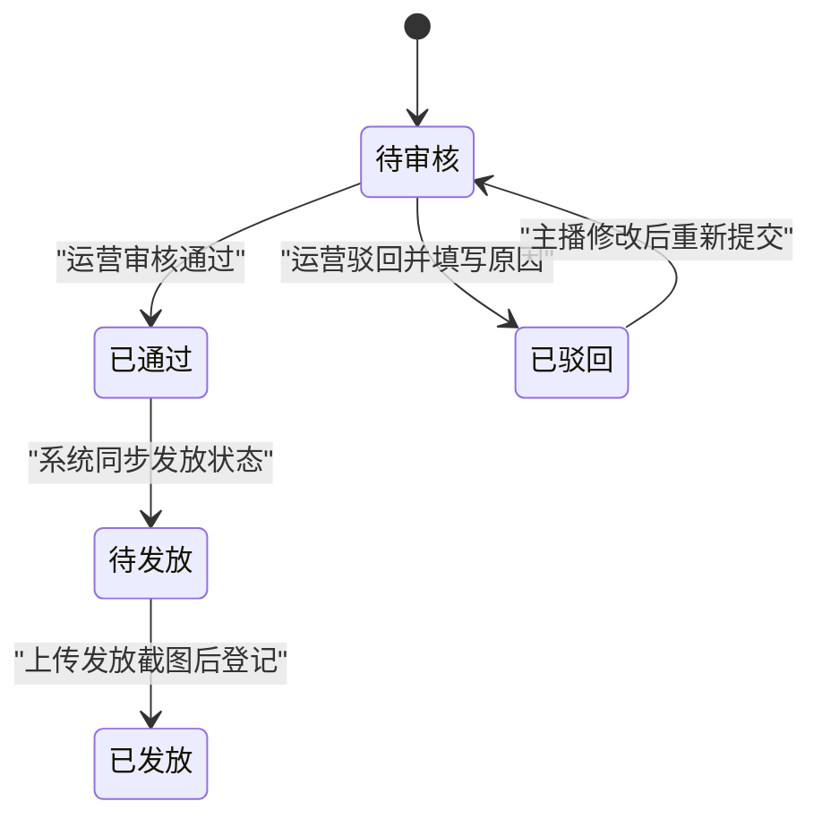

## 1. 架构设计


系统采用前后端分离架构：
- 前端负责企业微信内页面展示、动态表单渲染、权限路由、图片上传和后台操作界面。
- 后端负责企业微信登录校验、权限鉴定、规则配置、奖励计算、审核流转、发放留痕、导出报表。
- 数据库存储活动、规则、提交记录、审核记录、发放记录和账号权限数据。
- 对象存储保存提交截图和发放截图，数据库仅保存文件元信息和访问地址。
- 通知服务负责在提报、审核、驳回、发放等关键节点调用企业微信应用消息接口，并记录发送结果。

## 2. 技术说明
- 前端：React 18 + Vite + TypeScript + Tailwind CSS 3
- 后台状态管理：React Query + Zustand
- 表单能力：React Hook Form + Zod
- 后端：Node.js 20 + NestJS 10 + TypeScript
- 数据访问：Prisma ORM
- 数据库：PostgreSQL 14+
- 文件存储：S3 兼容对象存储
- 鉴权：企业微信 OAuth / 网页授权 + 服务端会话
- 导出：ExcelJS

## 3. 设计原则
- 统一模型：通过“活动类型 + 提报字段配置 + 奖励规则配置”支撑多种活动，而不是为每种活动单独写一套页面。
- 后端裁决：所有权限、状态流转、奖励计算以后端为准，前端只负责展示和发起操作。
- 可复用优先：礼物类、PK 类共用活动、提报、审核、发放、导出框架，只在统计逻辑层区分。
- 留痕优先：任何影响结果的动作都生成操作日志，便于后期核对。

## 4. 前端路由定义
| 路由 | 目的 |
|------|------|
| `/auth/callback` | 企业微信登录回调，换取用户身份并分流 |
| `/app/activities` | 主播活动列表页，查看可参与活动 |
| `/app/activities/:activityId/submit` | 主播提报页，根据活动类型渲染动态表单 |
| `/app/records` | 主播我的记录列表 |
| `/app/records/:recordId` | 主播记录详情和可编辑页面 |
| `/admin/dashboard` | 后台首页，展示待审核、待发放概览 |
| `/admin/records` | 运营/超管数据列表页 |
| `/admin/records/:recordId` | 记录详情、审核、修改、发放操作页 |
| `/admin/activities` | 超管活动管理页 |
| `/admin/activities/:activityId` | 活动配置详情页 |
| `/admin/rules` | 超管规则配置页 |
| `/admin/operators` | 运营老师账号管理页 |
| `/admin/exports` | 导出中心 |

## 5. 权限与身份方案
### 5.1 身份识别
- 所有人通过同一个企业微信自建应用登录。
- 后端通过企业微信返回的 `userId` 作为唯一身份标识。
- 系统本地仅维护后台账号角色：运营老师、超级管理员。
- 不在后台账号表中的企业微信用户，默认以主播身份进入主播端。

### 5.2 权限模型
| 角色 | 数据范围 | 关键动作 |
|------|----------|----------|
| 主播 | 仅自己的提交记录 | 新增提报、修改未审核记录、查看驳回原因和发放状态 |
| 运营老师 | 被选择为当前运营老师的记录 | 审核通过、驳回、修改、发放、导出本人权限范围数据 |
| 超级管理员 | 全部记录与全部配置 | 全局查看、全局修改、配置活动与规则、管理运营账号 |

### 5.3 关键权限规则
- 主播不可直接查看其他主播数据。
- 运营老师只能查看 `operator_id = 当前登录运营老师` 的记录。
- 超级管理员可跨运营老师查看和导出全部数据。
- 发放操作要求角色为运营老师或超级管理员，且记录状态必须已审核通过。

## 6. 活动类型与规则模型
### 6.1 活动类型抽象
| 字段 | 说明 |
|------|------|
| `type_code` | 活动类型编码，如 `gift_collection`、`pk_score` |
| `type_name` | 活动类型名称 |
| `aggregation_mode` | 统计方式，支持 `daily_sum`、`per_submission` |
| `entry_schema` | 提报表单结构定义 |
| `metric_unit` | 统计单位，如“礼物数量”“PK 值” |

### 6.2 当前活动类型策略
| 活动类型 | aggregation_mode | 表单结构 | 统计规则 |
|----------|------------------|----------|----------|
| 礼物收集类 | `daily_sum` | 多行礼物项目，字段为礼物项、数量 | 同主播同活动同日汇总后计算奖励 |
| PK 值类 | `per_submission` | 单值输入，字段为本场 PK 值 | 每次提交单独计算，不做日累计 |

### 6.3 奖励规则结构
- 奖励规则按“活动”维度配置，允许一个活动下有多条规则。
- 礼物类规则最少包含：礼物项、达标阈值、奖励类型、奖励内容、排序权重、启用状态。
- PK 类规则最少包含：PK 值阈值、比较方式、奖励类型、奖励内容、排序权重、启用状态。
- 同一个统计结果可命中多条奖励规则。

## 7. API 定义
### 7.1 TypeScript 类型
```ts
type UserRole = "anchor" | "operator" | "super_admin";

type ActivityTypeCode = "gift_collection" | "pk_score";

type ReviewStatus = "pending" | "approved" | "rejected";

type GrantStatus = "pending" | "granted";

interface Activity {
  id: string;
  name: string;
  typeCode: ActivityTypeCode;
  startAt: string;
  endAt: string;
  status: "draft" | "active" | "ended" | "disabled";
}

interface SubmissionBase {
  id: string;
  activityId: string;
  anchorUserId: string;
  anchorName: string;
  operatorId: string;
  liveDate: string;
  liveStartTime: string;
  reviewStatus: ReviewStatus;
  grantStatus: GrantStatus;
}

interface GiftSubmissionItem {
  metricType: "gift";
  itemId: string;
  itemName: string;
  quantity: number;
}

interface PkSubmissionItem {
  metricType: "pk";
  pkScore: number;
}

interface RewardHit {
  ruleId: string;
  rewardType: "cash" | "gift" | "other";
  rewardLabel: string;
  metricSummary: string;
}

type NotificationType =
  | "submission_created"
  | "review_approved"
  | "review_rejected"
  | "grant_completed";

type NotificationStatus = "pending" | "success" | "failed";
```

### 7.2 核心接口
| 方法 | 路径 | 说明 |
|------|------|------|
| `GET` | `/api/auth/wecom/callback` | 企业微信登录回调 |
| `GET` | `/api/me` | 获取当前用户身份与角色 |
| `GET` | `/api/activities` | 获取当前用户可见活动列表 |
| `GET` | `/api/activities/:id/form-schema` | 获取活动动态表单结构 |
| `POST` | `/api/submissions` | 新建提报记录 |
| `PUT` | `/api/submissions/:id` | 主播或后台修改记录 |
| `GET` | `/api/submissions/my` | 主播查询自己的记录 |
| `GET` | `/api/admin/submissions` | 后台查询记录列表 |
| `GET` | `/api/admin/submissions/:id` | 后台查看记录详情 |
| `POST` | `/api/admin/submissions/:id/review` | 审核通过或驳回 |
| `POST` | `/api/admin/submissions/:id/grant` | 标记已发放并上传发放截图 |
| `GET` | `/api/admin/activities` | 活动列表 |
| `POST` | `/api/admin/activities` | 创建活动 |
| `PUT` | `/api/admin/activities/:id` | 更新活动 |
| `GET` | `/api/admin/rules` | 查询奖励规则 |
| `POST` | `/api/admin/rules` | 创建奖励规则 |
| `PUT` | `/api/admin/rules/:id` | 更新奖励规则 |
| `GET` | `/api/admin/operators` | 查询运营老师账号 |
| `POST` | `/api/admin/operators` | 创建运营老师账号 |
| `GET` | `/api/admin/exports` | 导出报表 |
| `GET` | `/api/admin/notifications` | 查询通知发送记录 |
| `POST` | `/api/admin/notifications/:id/retry` | 重试失败通知 |

### 7.3 关键请求约束
- 新建或修改提报时，后端必须根据活动类型校验字段结构。
- 驳回接口必须要求 `reason` 非空。
- 发放接口必须要求 `proofAttachmentIds` 非空。
- 后台修改提报后，必须同步触发奖励重算。
- 提报成功、审核通过、审核驳回、发放成功后，后端必须触发通知发送流程。

## 8. 服务端架构图


### 8.1 模块拆分建议
- `auth`：企业微信授权、用户身份识别、会话管理。
- `accounts`：运营老师和超级管理员账号维护。
- `activities`：活动和活动类型管理。
- `rules`：礼物项、PK 项、奖励规则管理。
- `submissions`：提报创建、修改、查询、附件绑定。
- `aggregate`：日累计统计和场次统计。
- `review`：审核通过、驳回、审核日志。
- `grant`：发放登记、截图上传、发放日志。
- `notifications`：企业微信通知发送、模板组装、失败重试、通知日志。
- `export`：报表导出。
- `audit`：统一操作日志。

## 9. 数据模型
### 9.1 ER 图


### 9.2 核心表说明
| 表名 | 说明 |
|------|------|
| `wecom_users` | 企业微信登录用户基础信息，主播和后台人员共用 |
| `operator_accounts` | 后台运营老师与超级管理员账号表 |
| `activity_types` | 活动类型定义表 |
| `activities` | 活动主表 |
| `activity_items` | 活动可填写项表，礼物类放礼物项，PK 类放指标项 |
| `reward_rules` | 奖励规则表 |
| `submissions` | 场次提报主表 |
| `submission_items` | 场次提报明细表 |
| `attachments` | 提交截图和发放截图元数据 |
| `review_logs` | 审核、驳回、后台修改操作记录 |
| `reward_grants` | 奖励发放记录 |
| `notification_logs` | 企业微信通知发送记录 |
| `daily_aggregates` | 礼物类按天汇总缓存表，可选 |

## 10. 数据定义语言
### 10.1 建表示例
```sql
create table wecom_users (
  id uuid primary key,
  wecom_user_id varchar(64) not null unique,
  wecom_name varchar(100),
  avatar_url text,
  created_at timestamptz not null default now(),
  updated_at timestamptz not null default now()
);

create table operator_accounts (
  id uuid primary key,
  wecom_user_id varchar(64) not null unique,
  role varchar(20) not null check (role in ('operator', 'super_admin')),
  display_name varchar(100) not null,
  status varchar(20) not null default 'active',
  created_at timestamptz not null default now(),
  updated_at timestamptz not null default now()
);

create table activity_types (
  id uuid primary key,
  type_code varchar(50) not null unique,
  type_name varchar(50) not null,
  aggregation_mode varchar(30) not null,
  entry_schema jsonb not null,
  metric_unit varchar(30),
  created_at timestamptz not null default now()
);

create table activities (
  id uuid primary key,
  name varchar(100) not null,
  type_id uuid not null references activity_types(id),
  start_at timestamptz not null,
  end_at timestamptz not null,
  status varchar(20) not null default 'draft',
  description text,
  created_by uuid,
  created_at timestamptz not null default now(),
  updated_at timestamptz not null default now()
);

create table activity_items (
  id uuid primary key,
  activity_id uuid not null references activities(id),
  item_code varchar(50) not null,
  item_name varchar(100) not null,
  item_type varchar(30) not null,
  sort_order int not null default 0,
  enabled boolean not null default true
);

create table reward_rules (
  id uuid primary key,
  activity_id uuid not null references activities(id),
  item_id uuid references activity_items(id),
  compare_mode varchar(20) not null default 'gte',
  threshold numeric(18,2) not null,
  reward_type varchar(20) not null,
  reward_label varchar(200) not null,
  reward_payload jsonb,
  sort_order int not null default 0,
  enabled boolean not null default true,
  created_at timestamptz not null default now(),
  updated_at timestamptz not null default now()
);

create table submissions (
  id uuid primary key,
  activity_id uuid not null references activities(id),
  anchor_user_id uuid not null references wecom_users(id),
  anchor_name varchar(100) not null,
  operator_id uuid not null references operator_accounts(id),
  live_date date not null,
  live_start_time time not null,
  review_status varchar(20) not null default 'pending',
  grant_status varchar(20) not null default 'pending',
  reject_reason text,
  reward_snapshot jsonb,
  created_at timestamptz not null default now(),
  updated_at timestamptz not null default now()
);

create table submission_items (
  id uuid primary key,
  submission_id uuid not null references submissions(id) on delete cascade,
  item_id uuid references activity_items(id),
  item_name varchar(100) not null,
  quantity numeric(18,2) not null,
  extra_payload jsonb
);

create table attachments (
  id uuid primary key,
  submission_id uuid references submissions(id) on delete cascade,
  bucket varchar(100) not null,
  object_key varchar(255) not null,
  file_type varchar(20) not null check (file_type in ('submission_proof', 'grant_proof')),
  file_url text not null,
  created_at timestamptz not null default now()
);

create table review_logs (
  id uuid primary key,
  submission_id uuid not null references submissions(id) on delete cascade,
  action varchar(30) not null,
  operator_account_id uuid references operator_accounts(id),
  note text,
  created_at timestamptz not null default now()
);

create table reward_grants (
  id uuid primary key,
  submission_id uuid not null references submissions(id) on delete cascade,
  status varchar(20) not null check (status in ('pending', 'granted')),
  granted_by uuid references operator_accounts(id),
  granted_at timestamptz,
  remark text,
  proof_attachment_id uuid references attachments(id)
);

create table notification_logs (
  id uuid primary key,
  submission_id uuid not null references submissions(id) on delete cascade,
  notification_type varchar(50) not null,
  receiver_wecom_user_id varchar(64) not null,
  receiver_role varchar(20) not null,
  message_title varchar(200) not null,
  message_content text not null,
  status varchar(20) not null check (status in ('pending', 'success', 'failed')),
  error_message text,
  sent_at timestamptz,
  created_at timestamptz not null default now()
);

create index idx_submissions_activity_operator_date
  on submissions(activity_id, operator_id, live_date);

create index idx_submissions_anchor_activity_date
  on submissions(anchor_user_id, activity_id, live_date);

create index idx_notification_logs_submission_type
  on notification_logs(submission_id, notification_type);
```

### 10.2 初始化数据建议
```sql
insert into activity_types (id, type_code, type_name, aggregation_mode, entry_schema, metric_unit)
values
  ('00000000-0000-0000-0000-000000000001', 'gift_collection', '礼物收集类', 'daily_sum', '{"fields":["items","screenshots"]}', '数量'),
  ('00000000-0000-0000-0000-000000000002', 'pk_score', 'PK值类', 'per_submission', '{"fields":["pkScore","screenshots"]}', 'PK值');
```

## 11. 核心计算逻辑
### 11.1 礼物收集类
1. 根据提交所属活动和日期，拉取同一主播当天所有已提交记录。
2. 聚合同礼物项的数量，形成当日累计结果。
3. 使用累计结果匹配活动内启用的礼物奖励规则。
4. 返回命中的奖励列表，并写入 `reward_snapshot`。

### 11.2 PK 值类
1. 读取本次提交的 PK 值。
2. 使用单场 PK 值匹配活动内启用的 PK 奖励规则。
3. 返回命中的奖励列表，并写入 `reward_snapshot`。

### 11.3 重算触发点
- 主播修改提报后重算。
- 运营老师修改提报后重算。
- 超级管理员修改提报后重算。
- 奖励规则变更后，可选择对活动中的历史数据执行批量重算。

## 12. 通知触发逻辑
### 12.1 触发点
1. 主播提交成功后，发送 `submission_created` 通知给对应运营老师。
2. 运营老师审核通过后，发送 `review_approved` 通知给主播。
3. 运营老师驳回后，发送 `review_rejected` 通知给主播，并附带驳回原因。
4. 运营老师登记已发放后，发送 `grant_completed` 通知给主播。

### 12.2 实现策略
- 通知由后端业务成功后触发，不能依赖前端调用，避免页面关闭导致漏发。
- 通知内容由 `notifications` 模块统一组装，保证文案和变量格式一致。
- 发送前写入 `notification_logs`，发送成功或失败后更新状态。
- 失败通知支持后台查看和手动重试，第一版可不做自动重试队列。

## 13. 状态流转


说明：
- 审核状态与发放状态分开存储，避免“已通过但未发放”无法表达。
- 记录进入已发放前必须校验发放截图已上传。

## 14. 风险与建议
- 企业微信用户名称可能变化，业务展示名建议以“提交时填写的主播姓名”为准，登录昵称仅做辅助展示。
- 主播未建档会增加重名风险，建议后续在记录中始终保留企业微信用户 ID 作为实际归属主键。
- 礼物类按天累计、PK 类按场次统计属于两套口径，代码中应通过策略模式隔离，避免出现交叉污染。
- 导出数据量较大时建议异步生成文件，避免后台列表页卡顿。
- 企业微信消息发送可能受应用可见范围、接口限流或用户状态影响，必须保留失败日志并支持重试。
